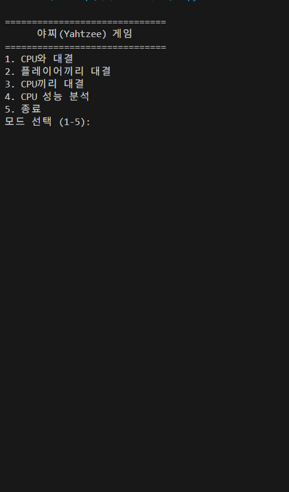
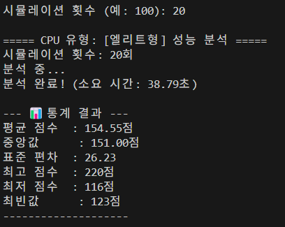

[Read this in English](./README.md)

# 🎲 Yahtzee AI: A Research Platform for Decision-Making Agents

[](https://www.python.org/)
[]()
[](https://github.com/dingo0880/Yahtzee_Ai_project/commits/main)

**인간의 의사결정을 모방하고 뛰어넘는 AI 에이전트 개발을 위한 연구 플랫폼입니다. 야찌(Yahtzee) 게임 환경을 통해 AI의 전략적 사고 진화 과정을 탐구하고, 머신러닝 모델 학습을 위한 플레이어 데이터를 수집합니다.**

---

<br>

## 🎬 프로젝트 시연 (Demonstration)

* **v2.5 최종 버전 플레이 시연**

    

* **AI 성능 분석 모드**

    

<br>

## 📖 프로젝트 소개 (Introduction)

이 프로젝트의 최종 목표는 **인간의 플레이 데이터를 학습하여 최적의 전략을 찾아내는 머신러닝(ML) 기반의 AI 에이전트를 개발**하는 것입니다. 그 목표를 달성하기 위한 첫 번째 단계로서, ML 모델 학습에 필수적인 **데이터 수집 플랫폼**이자 AI의 성능을 평가할 **실험 환경(Testbed)**으로 이 야찌 게임 애플리케이션을 구축했습니다.

단순히 게임을 구현하는 것을 넘어, "최적의 의사결정이란 무엇인가?"라는 근본적인 질문에 답을 찾아가는 여정입니다. ML 모델의 성능 비교를 위한 **베이스라인(Baseline) 모델**로서, 인간의 직감을 모방한 규칙 기반 AI부터 수학적 최적화를 추구하는 몬테카를로 시뮬레이션 AI까지 단계적으로 개발하고 그 한계를 분석했습니다.

<br>

## ✨ 주요 기능 (Key Features)

- **데이터 수집을 위한 핵심 기능:**
    - **게임 로그 저장:** 모든 플레이어의 `상황(State)`과 `행동(Action)`을 `.txt` 파일로 자동 저장하여, 차후 ML 모델 학습을 위한 데이터셋으로 활용합니다.
    - **상태 저장 및 이어하기:** `JSON` 파일을 통해 게임의 모든 상태를 저장하고 복원하여, 장시간의 데이터 수집 및 테스트를 용이하게 합니다.
- **AI 의사결정 모델의 진화 과정:**
    - **v0.1 (규칙/확률 기반):** 인간의 직감과 플레이 스타일을 모방한 베이스라인 AI
    - **v1.0 (결함 있는 MC):** 몬테카를로 시뮬레이션을 처음 도입했으나, '시간 개념(남은 굴림 횟수)'에 오류가 있었던 버전
    - **v1.5 (결함 수정 MC):** v1.0의 근본적인 오류를 해결한, 최초의 정상 작동 시뮬레이션 AI
    - **v2.0 (고급전략 AI):** '희생 전략', '동적 가중치' 등 고급 전략을 탑재한 버전
- **완성된 실험 환경:**
    - **다양한 게임 모드:** CPU 대전, 플레이어 간 대전, AI 성능 분석 모드 등 다양한 실험 환경 제공
    - **v2.5 (최종 완성본):** 모든 편의 기능이 추가된 안정적인 애플리케이션

<br>

## 🛠️ 기술 스택 (Tech Stack)

- **Language:** `Python`
- **Libraries:** `Pandas`, `itertools`, `json`

<br>

## ⚙️ 설치 및 실행 방법 (Installation & Usage)

1.  **레포지토리 클론:**
    ```bash
    git clone [https://github.com/dingo0880/Yahtzee_Ai_project.git](https://github.com/dingo0880/Yahtzee_Ai_project.git)
    cd Yahtzee_Ai_project
    ```
2.  **필요 라이브러리 설치:**
    ```bash
    pip install pandas
    ```
3.  **프로그램 실행:**
    ```bash
    python yahtzee_ai.py
    ```

<br>

## 🧠 AI 개발 과정 및 핵심 로직 (AI Development Process)

이 프로젝트의 핵심은 AI의 성장 과정입니다. 각 버전의 코드는 **[커밋 히스토리](https://github.com/dingo0880/Yahtzee_Ai_project/commits/main)** 에서 확인하실 수 있습니다.

### v0.1: 인간의 직감을 코드로 - 규칙 기반 AI
초기 AI는 '공격형', '안정형' 등 인간의 플레이 스타일을 모방하기 위해 복잡한 규칙과 확률 가중치 시스템으로 설계되었습니다. 이는 예측 불가능한 플레이를 보여주었지만, 최적의 수를 찾지 못하고 근시안적인(greedy) 선택을 하는 명백한 한계를 가졌습니다.

### v1.0 & v1.5: 더 높은 수준의 의사결정을 위한 몬테카를로 시뮬레이션 도입
규칙 기반의 한계를 넘어 수학적 최적화를 위해 몬테카를로 시뮬레이션을 처음 도입했습니다. 하지만 이 과정에서 AI가 **'남은 굴림 횟수'를 잘못 인지하는 치명적인 논리적 오류**를 발견했습니다. 이 실패의 원인을 분석하고, 시스템 전체에 `rolls_left` 상태 변수를 전달하도록 아키텍처를 리팩토링하여 비로소 정상적으로 작동하는 시뮬레이션 AI(v1.5)를 완성할 수 있었습니다.

### v2.0 ~ v2.5: AI 설계를 넘어, 완성된 사용자 친화적 애플리케이션으로
정상화된 시뮬레이션 AI에 **'동적 가중치'**와 **'전략적 희생'** 같은 고급 전략을 추가하여 AI의 두뇌를 완성했습니다(v2.0). 이후, 사용자의 편의성을 극대화하기 위해 **'저장/이어하기', '다시하기'** 등의 기능을 추가하여 하나의 완성된 소프트웨어(v2.5)로 프로젝트를 마무리했습니다.

> **[자세한 개발 과정 및 코드 분석 (블로그 링크)]**

<br>

## 🚀 앞으로의 계획 (Future Plans)

- **Phase 2: 데이터 수집 백엔드 구축**
    - `Django`와 `MySQL`을 이용해 모든 플레이 로그를 중앙 데이터베이스에 자동으로 수집하는 API 서버를 구축하여, 데이터 수집을 확장하고 자동화할 계획입니다.
- **Phase 3: 머신러닝 기반 AI 개발**
    - 수집된 '인간 고수'들의 플레이 데이터를 학습하여, 시뮬레이션 기반 AI를 뛰어넘는 새로운 머신러닝 기반의 '학습형 AI'를 개발하는 것을 최종 목표로 합니다.

<br>

## 🤔 배우고 느낀 점 (What I Learned)

- **규칙 기반 AI의 명확한 한계:** 초기 AI를 설계하며, 인간의 복잡한 직감을 `if/else`와 확률로 모델링하는 것의 한계를 체감했습니다. 아무리 정교한 규칙을 추가해도 모든 예외 상황을 처리할 수 없었고, 이는 AI 성능의 불안정성으로 이어졌습니다.
- **생성형 AI와의 협업 및 통제:** 이 프로젝트는 생성형 AI의 도움을 받아 개발되었지만, 그 과정에서 AI가 생성한 코드의 검증과 디버깅은 전적으로 개발자의 책임임을 깨달았습니다. 또한 AI가 임의로 규칙을 수정하거나 코드를 누락하는 경향을 교정하며, **AI를 효과적으로 제어하고 디렉팅하는 프롬프트 엔지니어링의 중요성**을 체감했습니다.
- **버그 수정을 통한 시스템 아키텍처 이해:** '남은 굴림 횟수' 오류를 수정하는 과정은 단순히 한 줄을 고치는 것이 아니었습니다. 게임의 메인 루프부터 AI의 가장 깊은 예측 함수까지 상태 변수를 전달하기 위해 **시스템 전체의 데이터 흐름을 리팩토링**해야 했습니다. 이 경험을 통해 작은 논리 오류가 어떻게 전체 시스템 아키텍처에 영향을 미치는지 실질적으로 이해할 수 있었습니다.
